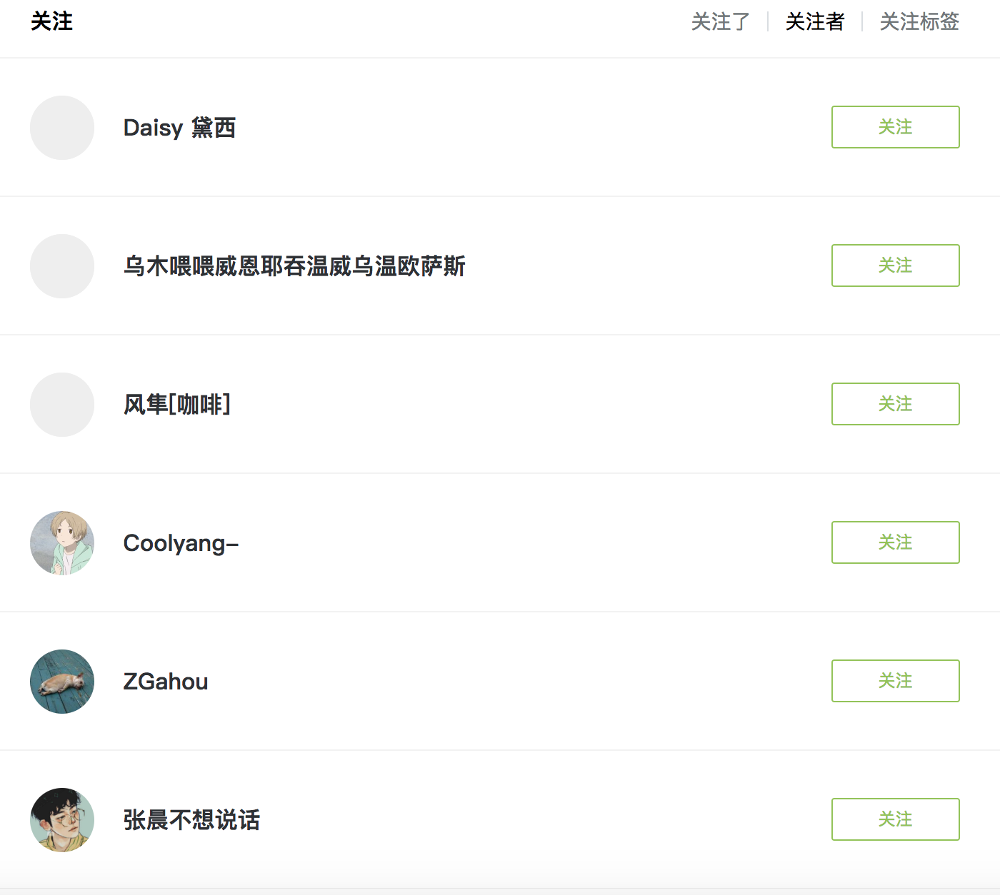

### JueJinSpider
主要是用来掘金用户信息爬虫

主要从用户关系入手，首先选取一个粉丝数量较大的用户作为起点，然后开启爬取其关注的用户和他的粉丝。

这里选了一个粉丝数量较多的用户：

可以看到有1w多的粉丝量。这里说一下为什么要选一个数量大的用户：这里选一个用户就是选一个起点，然后根据粉丝关系向广度和深度延伸，能延伸到多大的范围理论上来说是
跟起始用户的选择有很大关系的。粉丝量或者关注的人越多，能延伸到的用户就越多。所以尽可能选择一个数量较大的用户。

然后开始分析粉丝信息，关注的人和粉丝分析方法是一样的，找到其中一个方法就能很快解决另一个。

我们简单分析一下就可以知道，在用户个人信息页面有一个关注者，点击之后就能看到粉丝列表。

