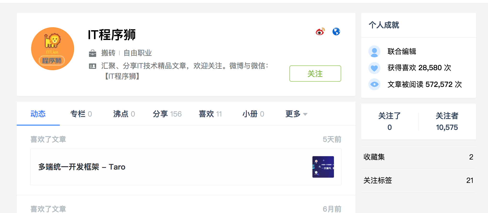

### JueJinSpider
主要是用来爬取掘金用户信息爬虫

主要从用户关系入手，首先选取一个粉丝数量较大的用户作为起点，然后开启爬取其关注的用户和他的粉丝。

这里选了一个粉丝数量较多的用户：

可以看到有1w多的粉丝量。这里说一下为什么要选一个数量大的用户：这里选一个用户就是选一个起点，然后根据粉丝关系向广度和深度延伸，能延伸到多大的范围理论上来说是
跟起始用户的选择有很大关系的。粉丝量或者关注的人越多，能延伸到的用户就越多。所以尽可能选择一个数量较大的用户。

然后开始分析粉丝信息，关注的人和粉丝分析方法是一样的，找到其中一个方法就能很快解决另一个。

我们简单分析一下就可以知道，在用户个人信息页面有一个关注者，点击之后就能看到粉丝列表。

然后分析网络请求，发现是这样的：

其中的 currentUid 可以不要，所以这个请求就只有一个动态的参数，那就是当前用户的id，当前用户的id很容易得到。

然后我们可以看到究竟返回了哪些信息

继续往下翻可以发现，第一次的请求是通过点击 关注者 按钮发送的，后边更多的粉丝信息是通过 ajax 查询的。但是通过ajax发送的请求和第一次不同。

可以看到 ajax的请求都多了一个before参数，这个参数从哪里来呢？
如果仔细分析了前边返回的json信息就会发现，每个用户都有一个 updatedAtString 字段，而下一次的请求都和上一次有关，下一次请求的 before 的值
